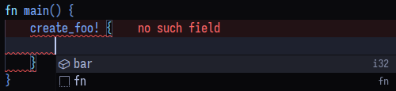
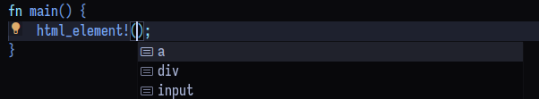

+++
title = "Improving autocompletion in your Rust macros"
+++

<!-- more -->

## Understanding Rust Analyzer autocompletion in macro invokations.

Lets start with a simple macro:

```rust
struct Foo {
    bar: i32,
}

macro_rules! create_foo {
    ($field:ident) => {{
        Foo {
            $field: 10,
        };
    }}
}
```

And lets say you are invoking this macro like this (where `|` is your cursor):

```rust
create_foo! {
    |
}
```

and then you ask RA for completions. For RA to suggest you things that make sense it more or less does the following:

It expands `create_foo` but adds a dummy identifier where your cursor is. So what it actually expands is:

```rust
create_foo! {
    intellijRulezz
}
```

where `intellijRulezz` is the dummy identifier. Then the macro gets expanded to:

```rust
{
    Foo {
        intellijRulezz: 10,
    }
}
```

Then RA uses the position of `intellijRulezz` as context to know what to
suggest. In this case, `intellijRulezz` landed on a field position, so it will
suggest `Foo`'s fields.



RA uses the same context for other actions such as `Rename`.

<video src="./renaming-foo-field.mp4" autoplay muted loop style="width: 100%;"></video>

### What if the token expands to two different places?

If we have the following macro

```rust
macro_rules! foo {
    ($bar:ident) => {{
        use std::fs::$bar;
        use std::io::$bar;
    }}
}
```

**Rust Analyzer will just take into account the first usage of the macro and ignore the others**.

### What about procedural macros?

RA does the same thing for procedural macros but it actually expands the macro
twice, with and without the dummy identifier and uses both expansions to know the context.

I don't understand much how this works but I've found that if both expansions
differ by too much, you don't get suggestions but you get them as soon as you
type something because now both expansions include an identifier (what you typed
and the dummy identifier).

So with this very simplified explanation, lets see what we can do to make our
macros more Rust Analyzer-friendly.

## Basic things you need to do

- Never panic in your macro.
- Fix up the user's input. If you know what's coming, use dummy values to fix
  the syntax of your macro's input.

```rust
fn my_macro(input: TokenStream) -> TokenStream {
    let input = input.into_iter();
    // let field_name = input.next().unwrap(); // NO!
    let field_name = input.next()
        .unwrap_or(TokenTree::Ident(Ident::new("foo", Span::call_site())));
    // Yes! We use a dummy identifier.
    // You might want to keep track of errors and show them later with `compile_error!`.
}
```

## Suggesting static data with modules and constants

If you want to suggest things that are not part of Rust code but they're
actually intrinsic to your DSL (lets say standard elements such as `<input>` for
HTML), you can use dummy `const`s in `mod`s to make Rust Analyzer suggest these things.

Lets create a `html_element!` macro to showcase this:

```rust
macro_rules! html_element {
    ($el:ident) => {{
        let el = stringify!($el);
        format!("<{el} />")
    }}
}
```

This macro accepts an identifier and returns a string in HTML form. The problem
is that we don't get any autocompletions. Lets fix this with a bit of trickery:

```rust
// Add a module with consts with the identifier we want to suggest
mod __html_elements {
    pub const input: () = ();
    pub const div: () = ();
    pub const a: () = ();
}

macro_rules! html_element {
    ($el:ident) => {{
        // Add a `use` statement to give some contex to Rust Analyzer.
        // We add a `cfg` attribute so that we don't get a compile error
        // if `$el` is not an element present in `__html_elements`.
        // Rust Analyzer seems to ignore the `cfg` for `use` statements;
        #[cfg(__never_compiled)]
        use __html_elements::$el;

        let el = stringify!($el);
        format!("<{el} />")
    }}
}
```

Now when we use the `html_element` macro, RA suggests `input`, `div` and `a`.



We can use the same trick for suggesting attributes by nesting modules.

```rust
mod __html_attrs {
    pub mod _base {
        pub const id: () = ();
        pub const class: () = ();
    }
    pub mod div {
        pub use _base::*;
    }
    pub mod a {
        pub use _base::**;
        pub use href: () = ();
    }
}

// Then, in an imaginary macro, expand like:
__html_attrs::$el::$attr;
```

This has the advantage of not dealing with complicated types as we'll see below
and potentially increasing compilation time.

## Suggesting Rust items

This sounds easy but in most cases it's more complicated than it looks like.

Take Dioxus' `rsx` macro and its following invokation:

```rust
rsx! {
    Component {
        |
    //  ^ cursor
    }
}
```

If we ask RA for completions, we get nothing meaningful.

Lets see why this happens using the following example:

```rust
use dioxus::prelude::*;

#[inline_props]
fn Box(cx: Scope, width: i32) -> Element {
    cx.render(rsx! {
        "width = {width}"
    })
}

fn App(cx: Scope) -> Element {
    cx.render(rsx! {
        Box {
            w|
        //  ^ cursor
        }
    })
}
```

I would expect RA suggesting the prop `width` but we don't. We get arbitrary statements.


But this is nothing strange if we take a look at the macro expansion. I'll include only the relevant snippet:

```rust
::dioxus::core::VNode {
    parent: None,
    key: None,
    template: std::cell::Cell::new(TEMPLATE),
    root_ids: Default::default(),
    dynamic_nodes: __cx.bump().alloc([__cx.make_node(w)]),
    //                                               ^ Here is the token we passed!
    dynamic_attrs: __cx.bump().alloc([]),
}
```

The token `w` actually lands in an "argument context". So RA suggests anything
that we can pass to the `make_node` function.

Lets make the `w` token land in a place where RA suggests the `width` prop. We can do that by using the full syntax for passing props:

```rust
fn App(cx: Scope) -> Element {
    cx.render(rsx! {
        Box {
            w|: 10,
        //  ^ cursor
        }
    })
}
```

And now we get the suggestions we want!


And here's the relevant part of output of the macro expansion:

```rust
dynamic_nodes: __cx.bump().alloc([__cx.component(
    Box,
    fc_to_builder(Box).w(10).build(),
    //                 ^ Here is the token we passed!

    // fc_to_builder(Box).wintellijRulezz(10).build(),
    // ^ When RA passes the dummy macro it looks like this:

    "Box",
)]),
```

The `fc_to_builder(Box)` call returns a builder for the props of `Box` so it
makes sense that RA gives the suggestions we want since it uses the expanded
location of the token as context.

So, while we are typing, the macro expands to something different to what will
expand once we finish typing.

### So how do we fix it?

Sadly, I'm not sure we can. There is a problem and it's that the grammar the
`rsx` macro accepts is very flexible and we get into a very common problem with
macros: **The macro is syntactically valid before we finish typing** and it's a
very hard problem to solve if we want to improve the autocompletion suggestions.

Consider the following code:

```rust
fn App(cx: Scope) -> Element {
    let w = 10;
    cx.render(rsx! {
        Box {
            w|
        //  ^ cursor
        }
    })
}
```

We want to suggest the prop `width` but the macro is already in a valid state
syntactically and semantically (we are passing the variable `w`). We cannot
expand to code that calls `fc_to_builder` because it will be broken since the
`w` method does not exist on it.

If Rust Analyzer didn't ignore inactive `#[cfg]` blocks, we could get away with
using them as we use them with the `use` statements but it doesn't seem to work
for other Rust code.

So my recommendation is:

### Make the grammar of your macro as unambiguous as you can.

The `rsx` macro could be written like so:

```rust
rsx! {
    .prop: value,
    Div {}
    input {}
}
```

In this way, as soon as we type the `.`, we know what comes is a prop assignment
and we can eagerly expand to code that RA can make use of.

This invokation:

```
rsx! {
    Box {
        .
    }
}
```

would expand to:

```rust
// invoked with the dummy identifier:
fc_to_builder(Box).intellijRulezz(());

// invoked normally:
fc_to_builder(Box)._noop(());
// ^ a `_noop` to fix up the tree with the expansion with the dummy identifier.
```

We then would get correct suggestions.

We compromised aesthetics for ergonomics (I atleast think so) in a place where
some completions are very much needed for fast development.
